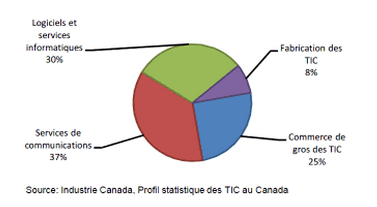
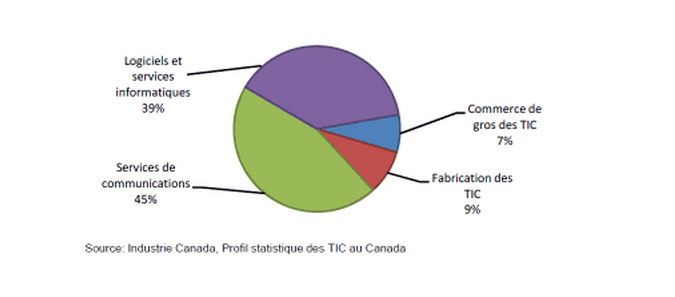
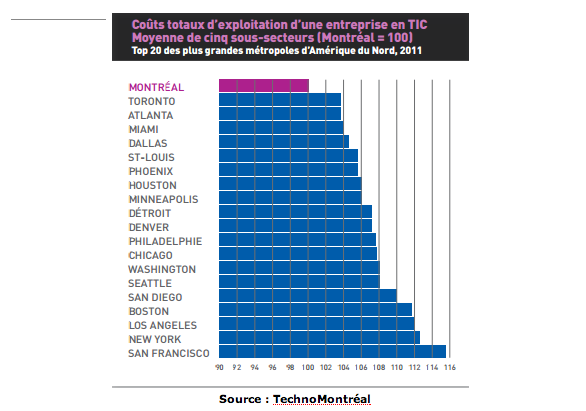
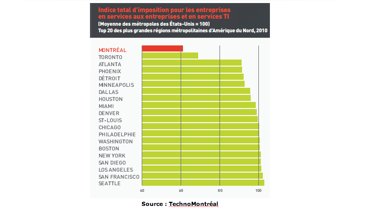
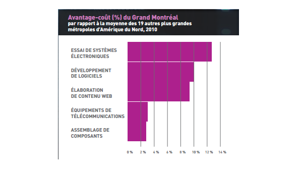

Annexe
=================

1. Recettes par sous-secteur des TIC (2011) 
-----------

2. PIB par sous-secteur des TIC 
-----------

3. Coût totaux d’exploitation d’une entreprise œuvrant dans les technologies de l’information et des communications 
-----------

4. Indice total d’imposition pour les entreprises en TI
-----------

5. Avantage-coût (%) du Grand Montréal
-----------

