###Les sites les plus populaires

Rang | Site | Catégorie
--- | --- | ---
1  | google.com | Engin de recherche
2  | facebook.com | Média social
3  | youtube.com | Média social vidéo
4  | yahoo.com | Portail
5  | live.com | Engin de recherche
6  | msn.com | Portail
7  | wikipedia.org | Encyclopédie
8  | blogspot.com | Média social blogue
9  | bing.com | Engin de recherche
10 | microsoft.com | Logiciel
11 | qq.com | Portail
12 | ask.com | Engin de recherche
13 | adobe.com | Logiciel
14 | taobao.com | Annonces classées
15 | twitter.com | Média social

[Source : Google](http://www.google.com/adplanner/static/top1000/) :  

Dans les 15 premiers sur la liste, on dénombre 4 engins de recherche et 3 médias sociaux. 

###Les moteurs de recherche

Rang | Site | Part de marché
--- | --- | ---
1 | Google | 88.8%
2 | Bing | 4.2%
3 | Baidu | 3.5%
4 | Yahoo | 2.4%
5 | Ask.com | 0.6%
6 | Autres | 0.5%

[Source](http://www.karmasnack.com/about/search-engine-market-share/)

###Les médias sociaux

> Les médias sociaux sont un groupe d’applications en ligne qui se fondent sur l’idéologie et la technologie du Web 2.0 et permettent la création et l’échange du contenu généré par les utilisateurs

[Andreas Kaplan et Michael Haenlein](http://fr.wikipedia.org/wiki/M%C3%A9dias_sociaux)

Rang | Site | Part de marché
--- | --- | ---
1 | Facebook | 61.82%
2 | Youtube | 21.33%
3 | Twitter | 1.85%
4 | Pinterest | 1.22%
5 | Yahoo! Answers | 0,90%
6 | Google+ | 0,73%
7 | LinkedIn | 0,83%
8 | Tagged | 0,55%
9 | Instagram | 0,37%
10 |Tumblr | 0,34%

[Source](http://www.dreamgrow.com/top-10-social-networking-sites-by-market-share-of-visits-january-2013/)

###Facebook

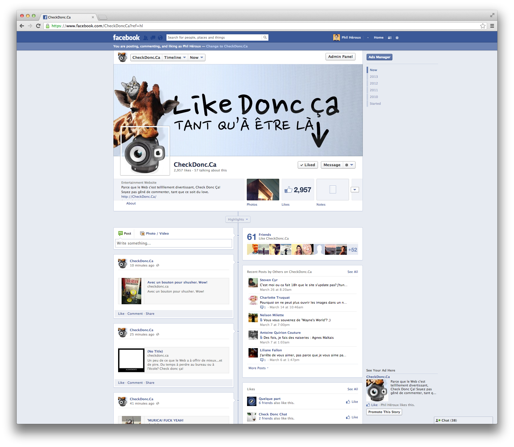

###Twitter

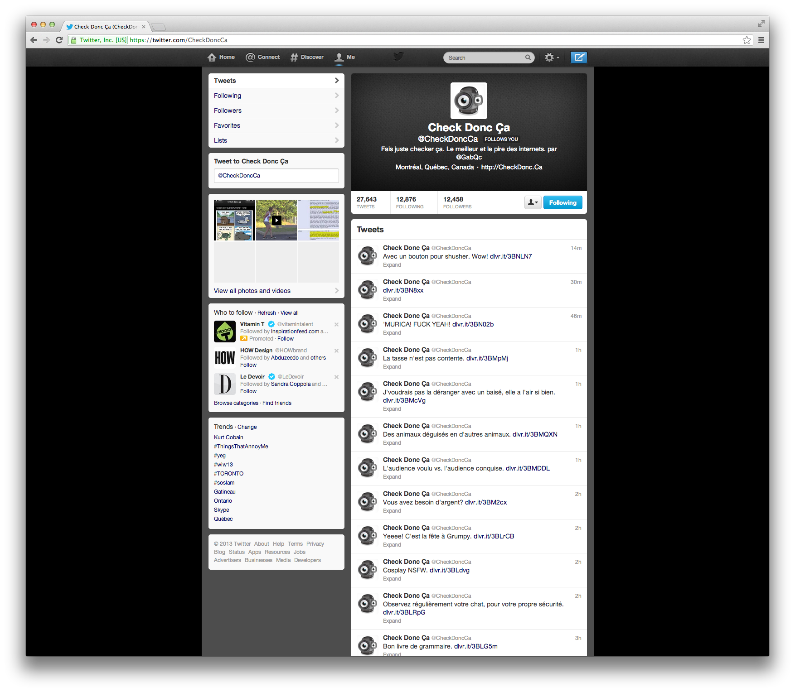

###Pinterest

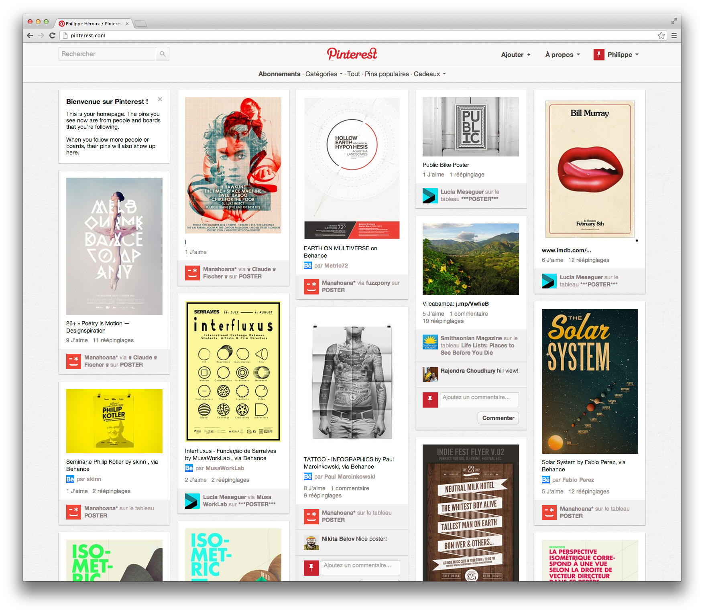

###Google Plus

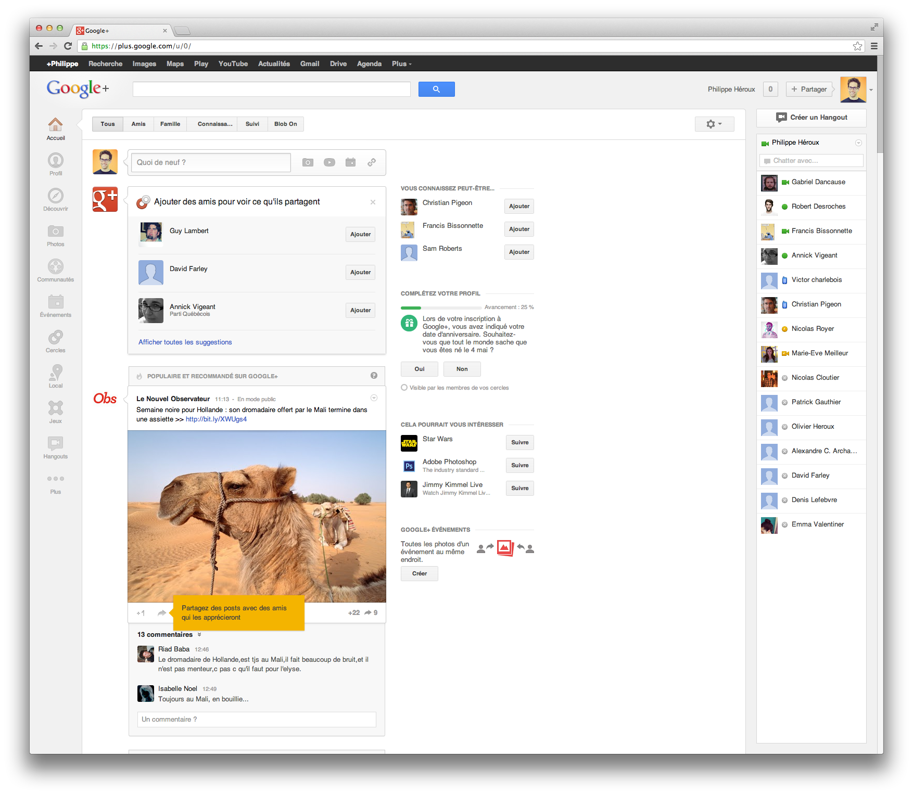

###Tumblr

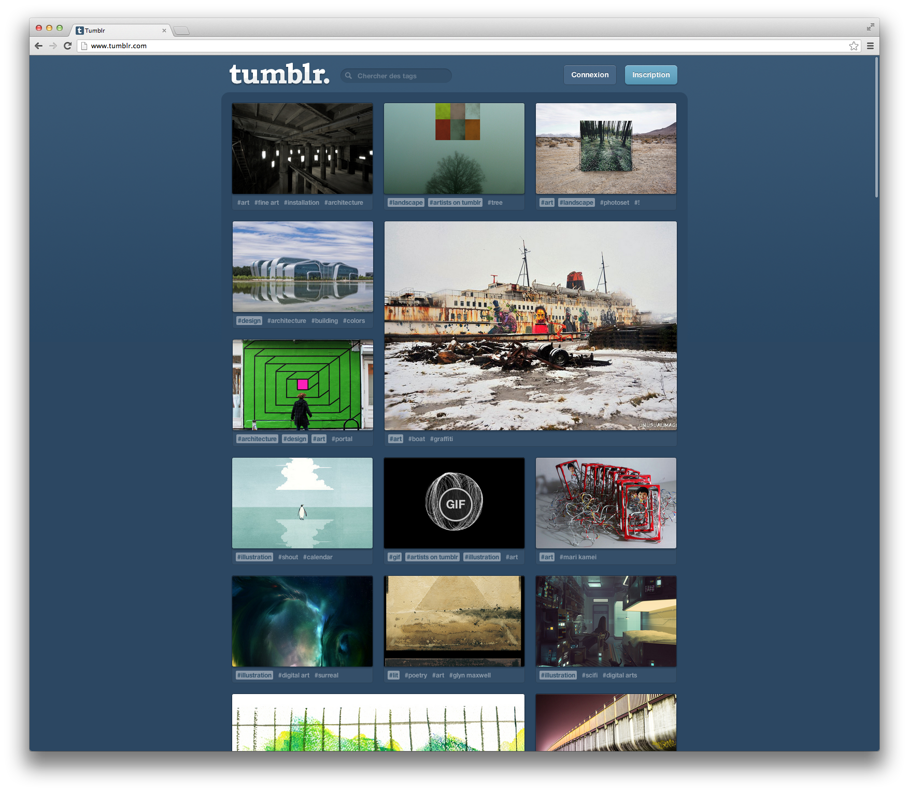

###Digg

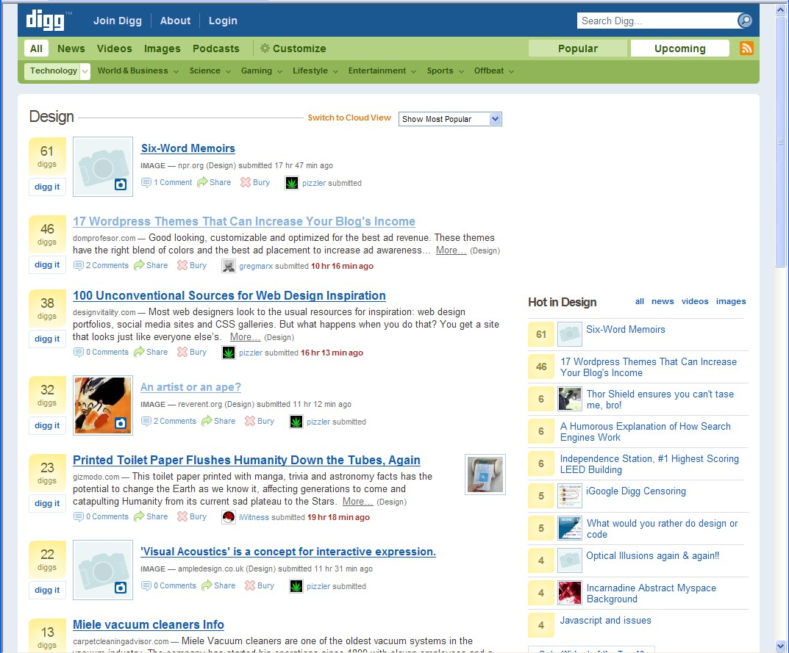

###Reddit

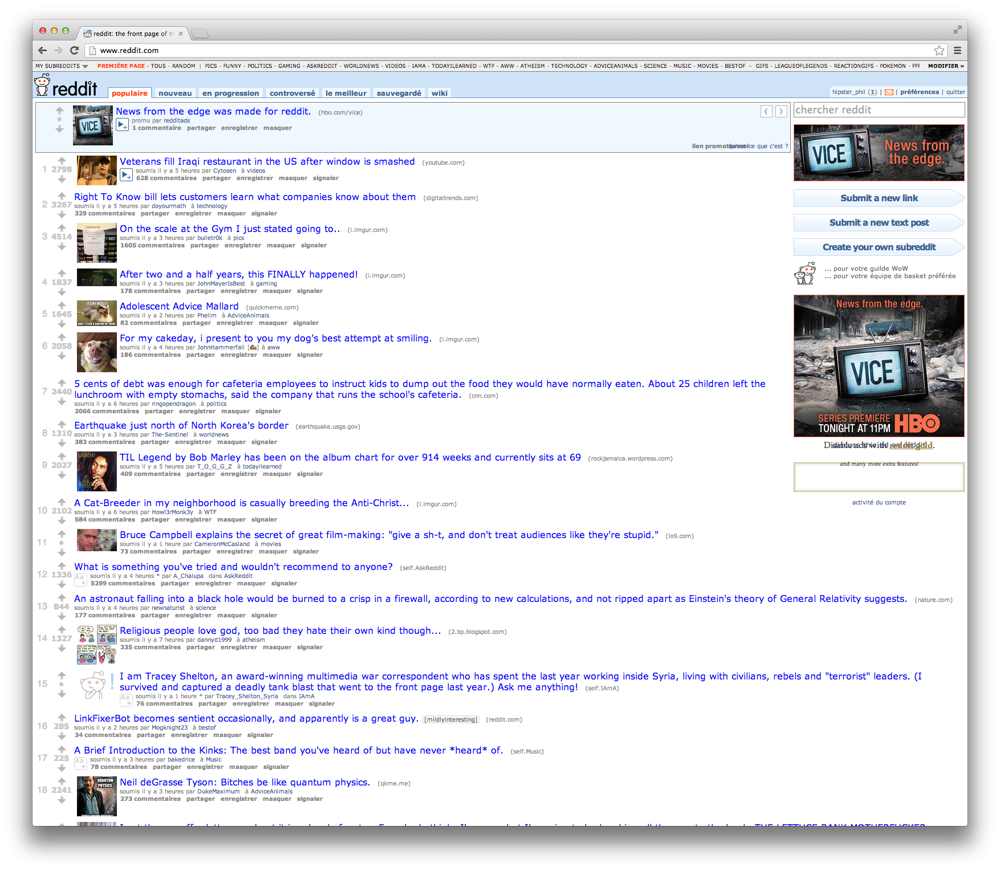

###Imgur

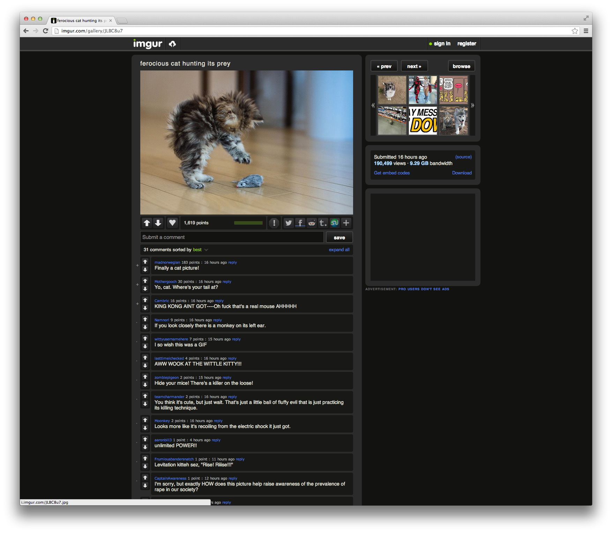

###Subreddit

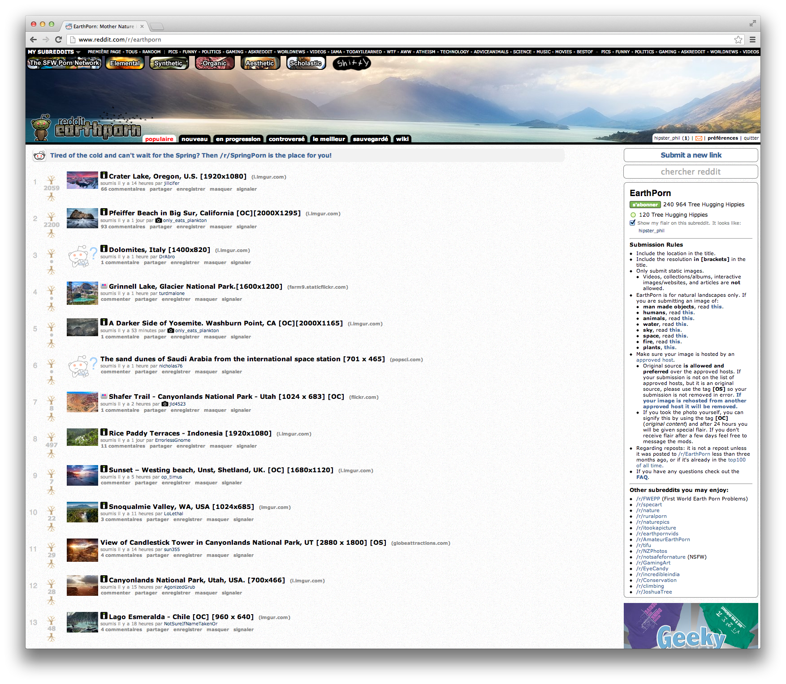

###Blobon

Blobon se veut un pont entre la recherche Web et les médias sociaux.

La mission de Blobon est de répertorier tout le contenu du Web et de le rendre intéressant à naviguer.

Voir le plan de développement pour la liste de fonctionnalités. 

###Le partage de profit

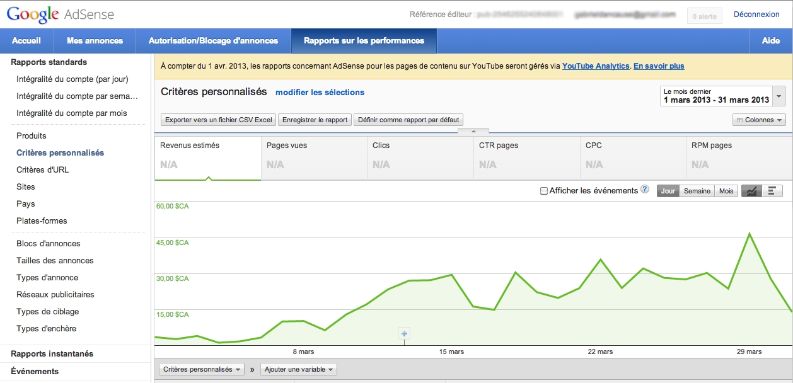

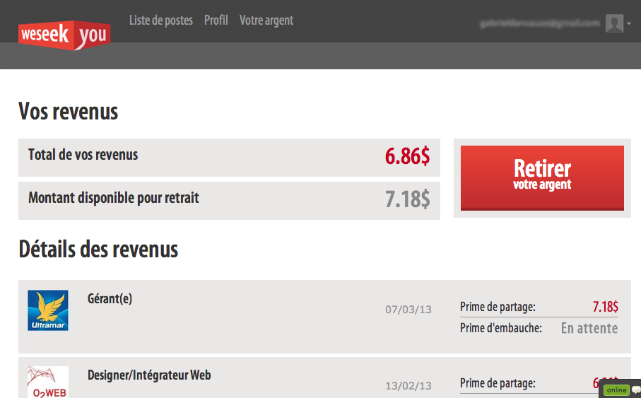

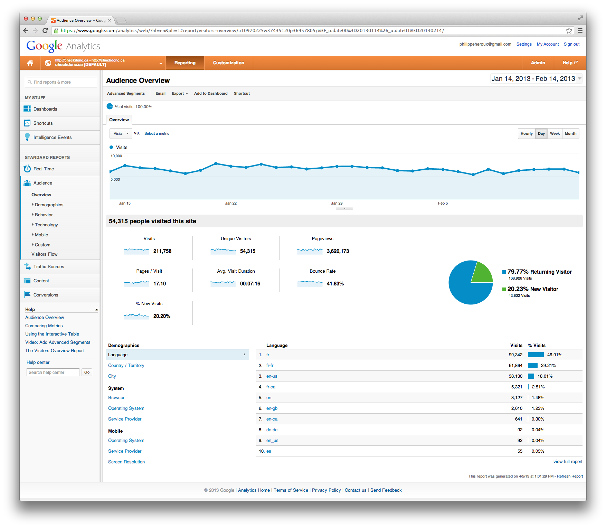

###CheckDonc.Ca

[CheckDonc.Ca](http://checkdonc.ca)

[Vente publicitaire et statistiques](http://checkdonc.ca/i/grille.pdf)

Auteur
-------

**Gabriel Dancause**

+ http://facebook.com/GabrielDancause
+ http://twitter.com/GabrielDancause
+ http://github.com/GabrielDancause

Copyright & license
---------------------

Copyright 2013 Blobon, Inc.

